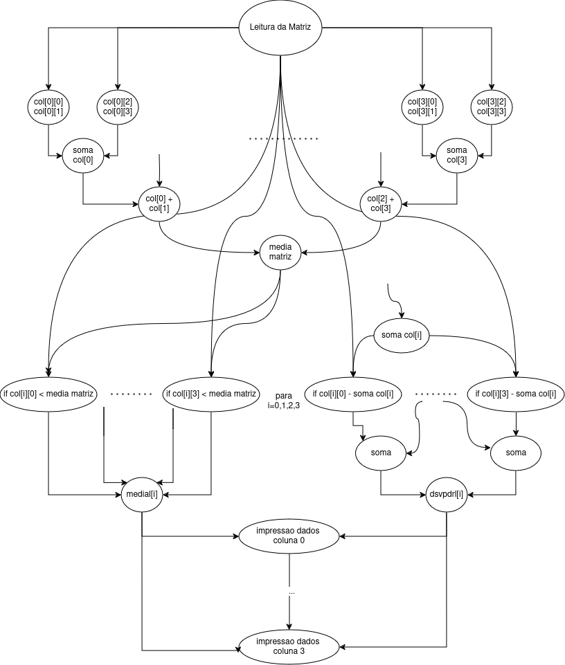
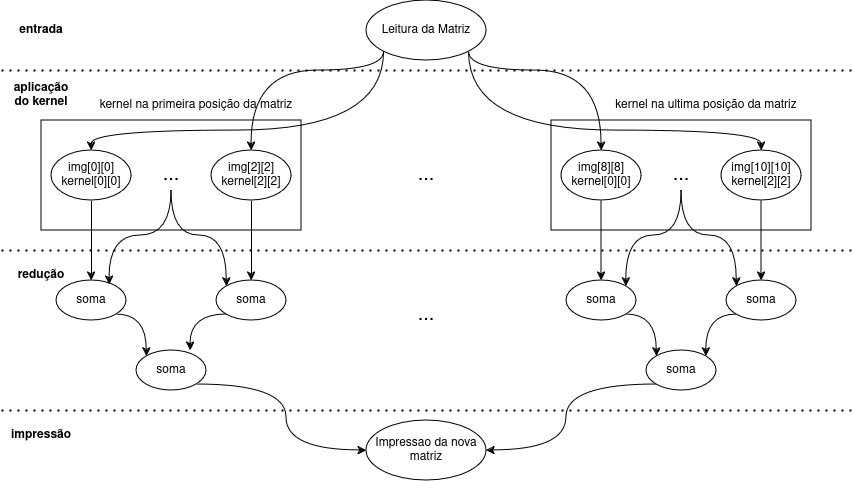

# Computação de Alto Desempenho

## PCAM
### Prova 1: cálculo de `medial[]` e `dsvpdr[]`  

**Particionamento:** é realizado um particionamento em duas etapas, tanto por dados quanto por tarefas. A leitura da matriz é feita de forma sequencial. Logo após, os valores de cada coluna `i` são somados utilizando redução e armazenados em `somacoluna[i]`. O vetor é então reduzido para encontrar a média dos valores da matriz. A seguir, o cálculo de `medial[]` e `dsvpdr[]` são realizados em paralelo. Um bloco contendo tarefas é criado para cada $i=0,1,2,3$ e `medial[i]` e `dsvpdr[i]`. Com os vetores calculados, as colunas são impressas em ordem, de forma sequencial. 

**Comunicação:** o cálculo de `medial[i]` utiliza o vetor `somacoluna[i]` além da média da matriz e os resultados são unificados utilizando região crítica em caso de memória compartilhada e redução em caso de memória distribuída. Já o cálculo de `dsvpdr[i]` utiliza `somacoluna[i]` e os valores obtidos durante a leitura da matriz, além de unificação semelhante ao caso passado.

### Trabalho 1

**Particionamento:** é realizado um particionamento por dados. A aplicação do kernel em cada posicção da matriz pode ser feita de forma paralela e as multiplicações (cada posição do kernel pelo valor correspondente) também. Uma tarefa lê ambas matriz de forma sequencial. Em seguida, são criados diversos blocos de tarefas, de forma que cada bloco irá cuidar de uma combinação *kernel $\times$ posição da matriz*. Serão criadas tarefas para multiplicar os elementos vizinhos ao kernel e tarefas dependentes para realizar a redução desses valores. Por fim, é realizada a impressão da nova matriz.

**Comunicação:** o grafo de comunicação é semelhante ao grafo de dependências. Devemos ressaltar, porém, que para cada ponto $i, j$ da imagem deve ser realizadas comunicação com os $m \times m$ vizinhos ao redor, de acordo com o kernel. Após as multiplicações em cada ponto, é realizada uma redução de forma que as tarefas se conversam em pares até encontrar o valor final de cada ponto da nova matriz.

**Aglomeração:** a etapa de aglomeração serve para planejar como as tarefas serão divididas entre os processadores. É importante notar que para cada aplicação do kernel na matriz, deve-se realizar comunicação com os valores vizinhos. Dessa forma, uma granulação mais fina pode aumentar a comunicação entre diferentes processos, aumentar a quantidade de dados replicados e deixar o processamento mais lento. Assim, é ideal utilizar uma granulação mais grossa na divisão de processos em threads e buscar jogar tarefas relativas a localidades próximas na mesma thread. 

**Mapeamento**: é dinâmico, de forma que cada elemento irá receber um processo. Esperamos que esse processo seja feito de maneira uniforme.

## Questões Teóricas
Resumo baseado nos conteúdos da Prova 1 de 2022 e no exercício proposto em Sala

### Qual a diferença entre o problema de consistência de memória e o problema de coerência de cache?

A consistência de memória garante que as operações de escrita e leitura em disco sejam realizadas da forma correta, utilizando-se, por exemplo, de regiões críticas. Já a coerência de cache busca garantir que todos os processadores tenham acesso às mesmas informações na cache através de invalidação e sincronização propostos em protocolos como o MESI.

### Quais fatores impedem a escalabilidade de um algoritmo paralelo?

O principal fator que impede a escalabilidade é o overhead de comunicação, que adiciona um custo fixo à adição de novos processores. Esse custo fixo corresponde a unificação de informação e comunicação entre processadores. Assim, nem sempre a paralelização irá promover um speedup satisfatório.

### Por que a GPU não é uma SIMD pura?

Uma máquina SIMD pura possui uma única thread com múltiplos dados. A GPU possui múltiplos threads, e dessa forma, se configura comoo um misto de MIMD e SIMD.
(falar sobre os dois níveis de multithread (primeiro sobre streaming multiprocessors que processam mesmas instrucoes em multiplas threads para multiplos dados e segundo sobre o conjunto de SMs, onde cada SM executa diferentes tarefas)

### Compare a rede Ômega (Multiestágio) com crossbar e barramento em relação a desempenho e custos.

As redes de barramento são bem simples, apresentando um baixo custo de implementação, em troca de um desempenho lento, dado que apenas uma comunicação pode acontecer por vez. Já a Crossbar supera esse problema ligando direamente os nós da rede em pares. A principal desvantagem dessa abordagem é o alto custo envolvido. As redes Ômega representam um meio termo entre as vantagem e desvantagens apresentadas nas primeiras redes. As entradas são conectadas às saídas através de vários estágios, garantindo uma comunicação robusta e eficiente sem altos custos presentes na Crossbar.

### Redes de Interconexão afetam diretamente o tempo de resposta ou o tempo de execução?

O tempo de execução é o tempo gasto por recursos do processador. As redes de interconexão interferem no tempo de comunicação, e não de execução. Dessa forma, podemos afirmar que apenas o tempo de resposta é afetado.

### Redes de Interconexão podem produzir speedup superlinear?

Não. O speedup superlinear é um evento muito específico que acontece quando a paralelização alivia a memória cache dos processaodre, garantindo menos acessos a memória principal e consequentemente tempo de resposta menor. 

### Redes de Interconexão podem afetar a Granulação de uma região paralela?

Sim. As redes de Interconexão podem afetar a granularidade de uma região paralela ao influenciar o custo de comunicação e sincronização entre os processos. Assim, uma computação de granulação fina e comunicação de elevado custo pode ser convertida em granulação grossa com baixa comunicação caso o desempenho da rede de Interconexão seja ruim.

### Qual a diferença entre overflow e underflow?
O overflow acontece quando estouramos o limite de representação de números antes da vírgula, isto é, da parte inteira. Já o underflow é um problema relacionado a mantissa, parte decimal.

### Processo VS Programa
Processos são programas em execução. Um processo mantém o estado do fluxo de execução (principalmente) em registradores e o estado do fluxo de dados disponíveis. Além destas informações, são mantidas várias outras sobre descritores de arquivos, comunicação, proprietário, tempos.

### Processos Paralelos VS concorrentes
Processos concorrentes são dois ou mais processos que iniciaram e ainda não
finalizaram a sua execução e concorrem pelos recursos de um sistema
computacional. Processos paralelos são uma especialização de processos
concorrentes, que sempre executam em elementos de processamento distintos ao
mesmo tempo.

### Speedup
Determina o ganho de desempenho, relacionando os tempos de
execução da versão sequencial e paralela. $S_p = T_{seq} / T_{parp}$

### Eficiência
Determina a eficiência no uso de p processadores, relacionando o
speedup e o número de processadores. $E = S_{pp} / p$

### Flynn Taxonomy


### MIMD com Memória Compartilhada - Multiprocessadores 
Diferente módulo de memória são usuais com mesmo endereçamento. As requisições podem ocorrer em ordenes diferentes da esperada, levando a incoerência. Os modelos a seguir organizam R/W nos módulos.

**Estrita**: escritas são visíveis instantaneamente a todos os processos. 
**Sequencial**: processos veem a mesma ordem de requisições de acesso à memória. 
**de Processador**: escritas de uma processo são observadas por ele na mesma ordem.
**Fraca**: sincronizações explícitas são consistentes sequencialmente. 
**de Liberação**: sincronizações explícitas são consistentes ao processador em relação aos demais. São introduzidas operações semelhantes a lock/unlock.

### Coerência de Cache com Memória Compartilhada
As caches são muito utilizadas, poiks reduzem demanda sobre redes de interconexão e a memórias mais lentas. Os dados replicados podem ficar desatualizados em writes.

**MESI (Modified, Exclusive, Shared, Invalid)**: é um protocolo para garantir coerência de cache. Funciona marcando blocos que sofreram alterações como inválido ou modificado e especificando blocos exclusivos ou compartilhados.

**Falso Compartilhamento**: ocorre quando dados fierentes de um bloco compartilhado são atualizados pelos processadores em suas caches. O bloco entã fica inválido mas de fato não precisaria. A solução é manter maior distância entre os dados espalhados nas caches.

### MIMD com Memória Distribuída - Multicomputadores
Nós são unidades assíncronas e independentes com CPU, memória e I/O.

**Clusters:** buscam redundância para garantir retorno de requisições não retornadas. **MPPs**: clusters de milhões de dólares.
**Grids**: sistemas utilizados para conectar computadores isolados geograficamente.

### SIMD - Supercomputadores
São ótimas para executar operações matriciais e vetoriais. Tradicionalmente processadores vetoriais são ULAs com pipeline cujos estágios operam números de ponto flutuante. Já processadores matricias são ULAs paralelas.

## Código
### Prova 1
``` c
#include <stdio.h>
#include <stdlib.h>
#include <omp.h>
#include <math.h>

#define N 10
#define T 10
// Esse código foi feito para rodar com T = N

int main(){
	char linebreak;
	int A[N][N];
	omp_set_num_threads(T);

	// Leitura da matriz
	for(int i = 0; i < N; i++){
		for(int j = 0; j < N; j++){
			scanf("%d", &A[i][j]);
		}
	}

	// Soma das colunas
	int soma_colunas[N], i, j;
	#pragma omp parallel shared(soma_colunas) private(i, j)
	{
		j = omp_get_thread_num();
		soma_colunas[j] = 0;
		for(i = 0; i < N; i++)
			soma_colunas[j] += A[i][j];
	}

	// Média da matriz
	double media = 0;
	#pragma omp parallel for reduction(+:media) private(i)
	for(i = 0; i < N; i++)
		media += soma_colunas[i];
	
	media = media / (N*N);
	
	// Média dos valores da matriz
	int medial[N], soma_diferenca[N];
	double dsvpdr[N];
	#pragma omp parallel
	{
		#pragma omp single
		{
			for(j = 0; j < N; j++){
				// Task medial
				#pragma omp task private(i)
				{
					medial[j] = 0;
					for(i = 0; i < N; i++)
						if (A[i][j] < media) 
							medial[j] += 1;
				}
				// Task dsvpdr
				#pragma omp task private(i)
				{
					soma_diferenca[j] = 0;
					for(i = 0; i < N; i++)
						soma_diferenca[j] += pow(A[i][j] - soma_colunas[j], 2);
					dsvpdr[j] = sqrt(soma_diferenca[j] / N);
				}
			}
		}
	}

	for(i = 0; i < N; i++)
		printf("(%d) dsvpdr = %f; medial = %d\n", i, dsvpdr[i], medial[i]);
	
	return 0;
}
```

