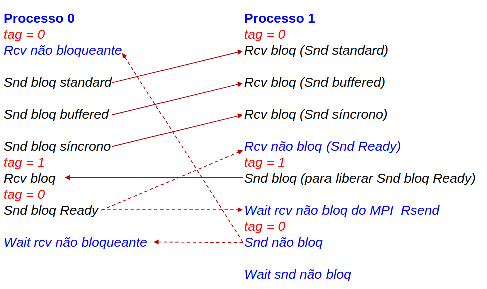

# Message Passing Interface (MPI)
MPI visa oferecer uma alternativa a programação sequencial presente nos códigos comuns. Diversas instâncias sequenciais que se comunicam formam o MPI e se comunicam através de mensagens. Se tornaram populares por funcionarem tanto em sistemas distribuídos quanto multiprocessadores. Utilizam o paradigma MPMD (Multiple Program, Multiple Data) ou SPMD (Single Program, Muliple Data).

Para usar, use `#include <mpi.h>` e compile com `mpicc -o programa programa.c -np 2`. A flag `np` indica que 2 processos serão criados.

## Programas MPI
- `MPI_Init()`: cada processo deve realizar uma call
- `MPI_COMM_WORLD()`: comunicador definido na inicialização. Cada comunicador possui um grupo, lista de processos.
- `MPI_Finalize()`: finaliza todos processos

``` {.c .numberLines}
#include <string.h>
#include <stdlib.h>
#include <stdio.h>
#include <mpi.h>

int main(int argc, char **argv)  {
  int my_rank, num_procs;
  int tag, src, dst, test_flag, i;
  int buffersize, sizemsgsnd, nrmsgs;

  char *buffersnd;
  char msgsnd[30], msgrcv[30], msgsync[30];

  MPI_Status  status;
  MPI_Request mpirequest_mr, mpirequest_mr_ready;

  MPI_Init(&argc, &argv);
  MPI_Comm_rank(MPI_COMM_WORLD, &my_rank);
  MPI_Comm_size(MPI_COMM_WORLD, &num_procs);

  ... // codigo

  free(bufrecv);
	fflush(0);
	ret = MPI_Finalize();
	if (ret == MPI_SUCCESS)
		printf("MPI_Finalize success! \n");
	return(0);
}
```

## Comunicação Ponto a Ponto
- **Síncrono**: recebe informação sobre a conclusão da comunicação, ou seja, a operação não completa (mesmo em background) até que o receiver receba a mensagem.
- **Assíncrono**: recebe informação apenas na sáida da mensagem.
- **Bloqueantes**: operações retornam apenas quando a operação foi concluída.
- **Não Bloqueantes**: operações retornam imediatamente e permite o programa realizar outras tarefas. Mais tarde é possível checar se o envio foi concluído.

O send não-bloqueante síncrono do MPI cria uma thread para processar a operação, permitindo que o programa continue a execução e recebe informação sobre a conclusão da comunicação, garantindo que o processo termine apenas quando o receiver receber a mensagem.

No caso que a comunicação bloqueante utiliza buffer, a mensagem está segura assim que for copiada para o buffer, permitindo que o send retorne. O receive bloqueante retorna quando recebe a mensagem diretamente do send ou do buffer de recebimento.

> Bloqueante não é sinônimo de síncrono em aplicações paralelas!

### Sends do MPI
- **Padrão** (`MPI_Send`): conclui quando a mensagem tiver sido enviada. Pode ou não ter buffer, a implementação decide. 
- **Buffered** (`MPI_Bsend`): o usuário deve criar o buffer com antedência.
- **Síncrono** (`MPI_Ssend`): sincroniza sender e receiver, e sabemos que a mensagem foi recebida.
- **Ready** (`MPI_Rsend`): se um receive existe, completa imediatamente, caso contrário o resultado é indefinido.

As primitivas não bloqueantes possuem um `I` na frente, como por exemplo `MPI_Isend`, o send padrão não bloqueante.



### Exemplo de comunicação ponto a ponto não bloqueante
No código abaixo, as primitivas send Padrão, Bloqueante e Síncrono são utilizadas

#### `modo-com.c`
```{.c .numberLines startFrom="29"}
tag = 0;
if (my_rank == 0)
{
    src = 1;  // determina o processo de origem de uma msg recebida como nao bloqueante
    dst = 1;  // determina o processo de destino das msgs enviadas pelo processo com rank 0

    // recebe msg com primitiva nao bloqueante standard
    MPI_Irecv(msgrcv, sizeof(msgrcv), MPI_CHAR, src, tag, MPI_COMM_WORLD, &mpirequest_mr);
    MPI_Test(&mpirequest_mr, &test_flag, &status);
    if(test_flag)
        printf("Rank 0: MPI_Test flag = %d, msgrcv=%s. \n", test_flag, msgrcv);
    else
        printf("Rank 0: MPI_Test flag = %d, nao recebeu a msg ainda. \n", test_flag);

    strcpy(msgsnd, "Blocking standard send");
    MPI_Send(msgsnd, strlen(msgsnd)+1, MPI_CHAR, dst, tag, MPI_COMM_WORLD);

    strcpy(msgsnd, "Blocking buffered send");
    MPI_Pack_size(strlen(msgsnd)+1, MPI_CHAR, MPI_COMM_WORLD, &sizemsgsnd);
    nrmsgs = 1; // apenas uma msg bsend sera enviada
    buffersize = sizemsgsnd + nrmsgs * MPI_BSEND_OVERHEAD;
    buffersnd = (char*) malloc(buffersize);
    MPI_Buffer_attach(buffersnd, buffersize);
    // envia a msg bsend usando o buffer criado pelo usuario
    MPI_Bsend(msgsnd, strlen(msgsnd)+1, MPI_CHAR, dst, tag, MPI_COMM_WORLD);
    MPI_Buffer_detach(buffersnd, &buffersize);

    strcpy(msgsnd, "Blocking synchronous send");
    MPI_Ssend(msgsnd, strlen(msgsnd)+1, MPI_CHAR, dst, tag, MPI_COMM_WORLD);

    tag = 1; // Se este MPI_Recv abaixo usar a tag 0 entao esta msg podera ser recebida pelo MPI_Irecv
    MPI_Recv(msgsync, sizeof(msgsync), MPI_CHAR, src, tag, MPI_COMM_WORLD, &status);

    tag = 0; // retorna para a tag = 0 usada nos sends e receives        
    strcpy(msgsnd, "Blocking ready send");
    MPI_Rsend(msgsnd, strlen(msgsnd)+1, MPI_CHAR, dst, tag, MPI_COMM_WORLD);

    if(!test_flag) {
        MPI_Wait(&mpirequest_mr, &status);
        printf("Rank 0: MPI_Wait liberou: msgrcv=%s. \n", msgrcv);
    }  
} // fim do if (my_rank == 0)
else   // my_rank == 1
{
    dst = 0; // determina o destino da msg a ser enviada
    src = 0; // determina o processo de origem da msg recebida
    
    // recebe do send bloqueante standard
    MPI_Recv(msgrcv, sizeof(msgrcv), MPI_CHAR, src, tag, MPI_COMM_WORLD, &status);
    printf("Rank 1: msg 01 recebida: %s \n", msgrcv);
    fflush(0);

    // recebe do send bloqueante com buffer
    MPI_Recv(msgrcv, sizeof(msgrcv), MPI_CHAR, src, tag, MPI_COMM_WORLD, &status);
    printf("Rank 1: msg 02 recebida: %s \n", msgrcv);
    fflush(0);

    // recebe do send bloqueante sincrono
    MPI_Recv(msgrcv, sizeof(msgrcv), MPI_CHAR, src, tag, MPI_COMM_WORLD, &status);
    printf("Rank 1: msg 03 recebida: %s \n", msgrcv);
    fflush(0);

    // dispara previamente o MPI_IRecv para o send bloqueante ready existente no processo 0
    MPI_Irecv(msgrcv, sizeof(msgrcv), MPI_CHAR, src, tag, MPI_COMM_WORLD, &mpirequest_mr_ready);

    tag = 1;
    strcpy(msgsync, "unlock ready send");
    MPI_Send(msgsync, strlen(msgsync)+1, MPI_CHAR, dst, tag, MPI_COMM_WORLD);
    // aguarda pelo recebimento da msg do MPI_Rsend. Ira finalizar o MPI_Irecv acima.
    MPI_Wait(&mpirequest_mr_ready, &status);
    
    printf("Rank 1: msg 04 recebida: %s \n", msgrcv);
    fflush(0);
    tag = 0;
    // send nao bloqueante
    strcpy(msgsnd, "Nonblocking standard send");  
    MPI_Isend(msgsnd, strlen(msgsnd)+1, MPI_CHAR, dst, tag, MPI_COMM_WORLD, &mpirequest_mr);
    MPI_Wait(&mpirequest_mr, &status);   
}
```
#### Saída
As mensagens são recebidas na ordem esperada
``` bash
$~ mpirun -np 2 --oversubscribe CommPontoAPonto
Rank 0: MPI_Test flag = 0, nao recebeu a msg ainda.
Rank 1: msg 01 recebida: Blocking standard send
Rank 1: msg 02 recebida: Blocking buffered send
Rank 1: msg 03 recebida: Blocking synchronous send
Rank 1: msg 04 recebida: Blocking ready send
Rank 0: MPI_Wait liberou: msgrcv=Nonblocking standard send.
```

## Grupos e Comunicação Coletiva
`MPI_COMM_WORLD` é o Intracomunicador padrão definido pelo MPI. Novos intracomunicadores especificam subgrupos de `MPI_COMM_WORLD`. Intercomunicadores permitem comunicações entre processos com intracomunicadores diferentes.

- **Barrier** (`MPI_Barrier`): N-to-N, sincroniza todos os processos.
- **Broadcast** (`MPI_Bcast`): 1-to-N, envia a mesma mensagem para todos processos no contexto.
- **Gather** (`MPI_Gather`): n-to-1, coleta dados dispersos entre todos os processos.
- **Scatter** (`MPI_Scatter`): 1-to-n, espalha informações de um processo sobre todos os processos de um domínio de comunicação.
- **Reduce** (`MPI_Reduce`): associa uma computação a comunicação, considerando todos os processos de um domínio.

Todas essas primitivas tem versões não bloqueantes. Há uma barreira não bloqueante, tal que processos retornam mesmo que os demais não tenham chegado na barreira.

### Exemplo de uso de primitivas coletivas (reduce)
Nesse código os processos somam os dados localmente e enviam para o root realizar a redução via soma.

#### `06-reduce.c`
``` {.c .numberLines startFrom="20"}
num_elements_per_proc = 4;

rand_nums = create_rand_nums(num_elements_per_proc);

for (i = 0; i < num_elements_per_proc; i++) {
  local_sum += rand_nums[i];
}

// Print the random numbers on each process
printf("Local sum for process %d - %f, avg = %f\n", world_rank, local_sum, local_sum / num_elements_per_proc);

// Reduce all of the local sums into the global sum
MPI_Reduce(&local_sum, &global_sum, 1, MPI_FLOAT, MPI_SUM, root, MPI_COMM_WORLD);

// Print the result
if (world_rank == root) {
  printf("Total sum = %f, avg = %f\n", global_sum, global_sum / (world_size * num_elements_per_proc));
}
```

#### Saída
``` bash
$~ mpirun -np 4 06-reduce 4
Local sum for process 2 - 2.332896, avg = 0.583224
Local sum for process 3 - 2.419048, avg = 0.604762
Local sum for process 0 - 2.816110, avg = 0.704027
Local sum for process 1 - 2.999350, avg = 0.749838
Total sum = 10.567404, avg = 0.660463
```

## Intercomunicadores
Primitivas coletivas têm comportamentos diferentes com intercomunicadores. No caso do `MPI_Gather`, o processo root não fornece uma porção dos dados. De forma semelhante, no `MPI_Scatter`, o root não recebe uma porção dos dados. 

A geração de novos processos é feita com `MPI_Comm_spawn()`

### Exemplo de spawn de processos e intercomunicadores
São criados `NUM_SPAWNS` processos filhos a partir do master. 

#### `03-spawn-collective-master.c`
``` {.c .numberLines startFrom="65"}
#define NUM_SPAWNS 4

char msg_0[] = "hello worker, i'm your master";
char msg_1[50], master_data[] = "workers to work", worker[40];

MPI_Get_processor_name(processor_name, &name_len);
for (i = 0; i < NUM_SPAWNS; i++)
    vet[ i ] = i;
src = dst = root = 0;
MPI_Comm_spawn(worker, MPI_ARGV_NULL, NUM_SPAWNS, MPI_INFO_NULL, root, MPI_COMM_WORLD, &inter_comm, errcodes);

MPI_Send(msg_0, 50, MPI_CHAR, dst, tag, inter_comm);
MPI_Irecv(msg_1, 50, MPI_CHAR, src, tag, inter_comm, &mpirequest_mr);

MPI_Send(master_data, 50, MPI_CHAR, dst, tag, inter_comm);

MPI_Scatter(vet, 1, MPI_INT, &buf_rcv, 1, MPI_INT, MPI_ROOT, inter_comm);
MPI_Gather(vet, 1, MPI_INT, &vet_master, 1, MPI_INT, MPI_ROOT, inter_comm);

MPI_Wait(&mpirequest_mr, &status);

for (i = 0; i < NUM_SPAWNS; i++) 
printf("Master (%s): msg_1=%s,vet[%d]=%d,buf_rcv=%d,vet_master[%d]=%d\n",processor_name,msg_1,i,vet[i],buf_rcv,i,vet_master[i]);
```

#### `03-spawn-collective-worker.c`
``` {.c .numberLines startFrom="34"}
vet = (int*) malloc(num_proc*sizeof(int));

src = dst = root = 0;
if ( my_rank == 0 )	
{
  MPI_Recv(msg_0, 50, MPI_CHAR, src, tag, inter_comm, &status);
  MPI_Send(msg_1, 50, MPI_CHAR, dst, tag, inter_comm);

  MPI_Recv(master_data, 50, MPI_CHAR, src, tag, inter_comm, &status);
  strcpy(workers_data, master_data);
}
MPI_Bcast(workers_data, 50, MPI_CHAR, root, MPI_COMM_WORLD);

MPI_Scatter(vet, 1, MPI_INT, &buf_rcv, 1, MPI_INT, root, inter_comm);

for (i = 0; i < num_proc; i++){
  printf("SLV nr %d (%s):workers_data=%s,vet[%d]=%d,buf_rcv=%d\n", my_rank, processor_name, workers_data, i, vet[i], buf_rcv);
}

MPI_Gather(&buf_rcv, 1, MPI_INT, vet, 1, MPI_INT, root, inter_comm);
```

O master preenche `vet=[0,1,2,3]` e realiza o Spawn de 4 processos *worker*. O master realiza um `Send`, recebido pelo Worker 0 e responde com um `Send`, recebido pelo Master com `IRcv`. O Master realiza um `Send` `master_data`, recebido pelo Worker 0, que faz o broadcast para o grupo de workers. O master realiza um Scatter de `vet` e o worker 0 faz um Scatter de `vet`, que possui lixo. Ambos processos realizar o Gather para receber as informações. Os workers printam lixo, pois o Gather ocorre após o `print`.

#### Saída
``` bash
$~ mpirun --np 1 --oversubscribe 03-spawn-collective-master
SLV nr 0 (camel):workers_data=workers to work,vet[0]=-1653793569,buf_rcv=0
SLV nr 0 (camel):workers_data=workers to work,vet[1]=22484,buf_rcv=0
SLV nr 0 (camel):workers_data=workers to work,vet[2]=0,buf_rcv=0
SLV nr 0 (camel):workers_data=workers to work,vet[3]=0,buf_rcv=0
SLV nr 2 (camel):workers_data=workers to work,vet[0]=-1151853675,buf_rcv=2
SLV nr 2 (camel):workers_data=workers to work,vet[1]=28878,buf_rcv=2
SLV nr 2 (camel):workers_data=workers to work,vet[2]=0,buf_rcv=2
SLV nr 2 (camel):workers_data=workers to work,vet[3]=0,buf_rcv=2
SLV nr 3 (camel):workers_data=workers to work,vet[0]=754593807,buf_rcv=3
SLV nr 3 (camel):workers_data=workers to work,vet[1]=29987,buf_rcv=3
SLV nr 3 (camel):workers_data=workers to work,vet[2]=0,buf_rcv=3
SLV nr 3 (camel):workers_data=workers to work,vet[3]=0,buf_rcv=3
SLV nr 1 (camel):workers_data=workers to work,vet[0]=597966703,buf_rcv=1
SLV nr 1 (camel):workers_data=workers to work,vet[1]=31262,buf_rcv=1
SLV nr 1 (camel):workers_data=workers to work,vet[2]=0,buf_rcv=1
SLV nr 1 (camel):workers_data=workers to work,vet[3]=0,buf_rcv=1
Master (camel): msg_1=hi master,vet[0]=0,buf_rcv=805306368,vet_master[0]=0
Master (camel): msg_1=hi master,vet[1]=1,buf_rcv=805306368,vet_master[1]=1
Master (camel): msg_1=hi master,vet[2]=2,buf_rcv=805306368,vet_master[2]=2
Master (camel): msg_1=hi master,vet[3]=3,buf_rcv=805306368,vet_master[3]=3
```

## MPI e OMP
MPI com OMP permite executar diferentes processos MPI em máquinas (ou nós ou hosts) distintas, onde cada processo MPI com suas threads compartilhando memória na máquina local. Há um conjunto de funções no MPI para o suporte de threads com OMP, sendo a mais importante `MPI_Init_thread()`.

``` {.c .numberLines startFrom="32"}
if ( myrank == 0) 
{
  for (i = 1; i < npes; i++)
  {
    MPI_Recv(bufrecv, MAXMESSAGE, MPI_CHAR, MPI_ANY_SOURCE, 
                        MPI_ANY_TAG, MPI_COMM_WORLD, &status);
    printf("%s\n", bufrecv);
    fflush(0);
  }
}
else 
{
  // OMP sequential region
  #pragma omp parallel private(local_i, total_threads, thread_number) shared(i) num_threads(NT)
  {
    // OMP parallel region
      total_threads = omp_get_num_threads();
      thread_number = omp_get_thread_num();
      #pragma omp critical (adding)
      {
        local_i = ++i;
      }
      printf("Hello from thread %d/%d, from process %d/%d on %s. i = %d\n", 
        thread_number, total_threads, myrank, npes, processor_name, local_i);
  }
  // OMP sequential region
  msgtag = 1;
  sprintf(bufsend, "Hello World from process %d with i=%d", myrank, i);
  fflush(0);
  dest = 0;
  MPI_Send(bufsend, strlen(bufsend)+1, MPI_CHAR, dest, msgtag, MPI_COMM_WORLD);
}
```

O processo 0 realiza o `MPI_Recv` dos processos 1 e 2, os quais criam threads utilizando OpenMP. Cada uma das threads criadas realiza um print. No final, cada processo realiza um `MPI_Send`.

``` bash
$~ mpirun -np 3 --oversubscribe 02-hello-mpi-omp-snd-rcv
Hello from thread 3/4, from process 2/3 on camel. i = 1
Hello from thread 1/4, from process 2/3 on camel. i = 2
Hello from thread 2/4, from process 2/3 on camel. i = 3
Hello from thread 3/4, from process 1/3 on camel. i = 1
Hello from thread 1/4, from process 1/3 on camel. i = 2
Hello from thread 0/4, from process 1/3 on camel. i = 3
Hello from thread 2/4, from process 1/3 on camel. i = 4
Hello from thread 0/4, from process 2/3 on camel. i = 4
Hello World from process 1 with i=4
Hello World from process 2 with i=4
MPI_Finalize success!
MPI_Finalize success!
MPI_Finalize success!
```

# Compute Unified Device Architecture (CUDA)
Nos anos 2000 surgiram as GPUs (Graphics Processing Units) para substituir controladores VGA. Essas GPUs possuem características SIMD, porém não são SIMD puras. Implementam o paradigma SIMT (Single Instruction Multiple Thread), onde uma única instrução é executada por múltiplas threads. SIMT flexibiliza máquinas SIMD por não estarem restritas à execução de uma única instrução, mas à execução simultânea de múltiplas threads, majoritariamente executando a mesma instrução.

## Modelo de Programação CUDA
CUDA (Compute-Unified Device Architecture) é um modelo de programação paralela que atua como uma extensão de C/C++ e Fortran para programar dispositivos heterogêneos e começou a ser desenvolvido pela NVDIA em 2006.

- **Thread**: Thread CUDA é um vetor de instruções SIMD a serem executadas sequencialmente. Esse vetor é replicado e opera sobre dados diferentes. 
- **Warp**: é um conjunto de 32 threads CUDA, de um bloco de threads, que são executadas simultaneamente.
- **Host**: CPU e sua hierarquia de memória (host memory)
- **Device**: GPU e suas memórias (device memory)
- **Kernel**: função que é replicada na GPU como múltiplas threads

Sobre memória, é importante saber que as memórias do host e do device são usualmente separadas. 
A gerência de memória do *device* é feito utilizando as funções `cudaMalloc(), cudaFree(), cudaMemcpy()`, que são análogas ao C.

## Hierarquia de Threads
- **Threads**: possuem memória local à thread e ao bloco;
- **Blocos**: cada bloco pode agrupar até 1024 threads. Threads de um mesmo bloco são executadas em um mesmo Streaming Multiprocessor;
- **Grids**: agrupam blocos, permitem que diferentes blocos utilizem a memória global do *device*.

## Lançamento de Threads em Paralelo na GPU
- `__global__`: chamado pelo host e executado no device
- `__device__`: chamado pelo device e executado no device
- `__host__`: chamado pelo host e executado no host (default)

Para lançar um kernel use `funcaoKernel<<<NumeroDeBlocos,NumeroDeThreads>>>(args)`

## Memória nas GPUs
### Memória global 
Memória DRAM acessada por quaisquer threads de qualquer SM. Possui o maior tamanho na GPU mas tem acesso mais lento. São armazenadas na memória global variáveis declarados com `__device__`, como argumento das funções de kernel e alocadas dinâmicamente com o uso do `cudaMalloc()`.

### Memória local à thread 
Memórias SRAM, privadas às threads. Variáveis declaradas dentro do kernel possuem memória local. 
**Exemplo**: `tam, i, j` estão na memória local. `matrizA, matrizB e matrizC` estão na global devido ao `cudaMalloc()`

``` {.c}
#define TAM 100
__global__ void soma(int *matrizA, int *matrizB,int *matrizC, int tam)
{
  int i = blockDim.x * blockIdx.x + threadIdx.x;
  int j = blockDim.y * blockIdx.y + threadIdx.y;
  if (i < tam && j < tam)
  {
    matrizC[i*TAM+j]=matrizA[i*TAM+j]+matrizB[i*TAM+j];
  }
} 
```
### Memória compartilhada 
Threads de um mesmo bloco compartilham essa memória. Possuem uma latência menor e uma largura de banda maior comparadas à memória global.

- **Alocação estática**: `__shared__`
- **Alocação dinâmica**: `extern __shared__`

A memória compartilhada não permite transferência de dados com o host. Nesse caso, a global deve ser utilizada.

### Memória constante 
Permite apenas leitura do kernel, com tempo de latência menor que a memória global. São visíveis para todas as threads da *Grid*. Utiliza o modificador `__constant__` no host.

### Memória unificada
Permite a cópia implícita de memória entre host e device. Não reduz o tempo de execução de um programa, de forma que as transferências de memória continuam acontecendo, sob demanda, transparentemente.

- **Alocação estática**: variável global no host usando `__managed__`
- **Alocação dinâmica**: `cudaMallocManaged()` no host

### Registradores 
Localizados nos SPs e armazenam o estado das threads em execução no SM

### Memória de textura 
Memória DRAM que armazena coordenadas e outros dados referentes à textura das imagens e têm o apoio de caches de textura

## Operações Atômicas
Operações atômicas protegem regiões críticas em CUDA. `atomicAdd()` é um exemplo de operação atômica em função `__device__`.

CUDA usa primitivas streams que determinam uma sequência de comandos na GPU. Múltiplos streams podem executar concorrentemente, maximizando o uso de recursos. Para tanto é necessário utilizar memórias não pagináveis (pinned memories ou page-locked) no host, o que habilita a execução concorrente das atividades de uma stream ou memória mapeada (mapped memory ou zero-copy memory), que permite memória não paginável do host ser mapeado na memória do device.

- `malloc()`: aloca memória paginável no host
- `cudaMalloc()`: aloca memória no device
- `cudaMallocManaged()`: aloca memória paginável com ptr para ambos: host e device. memória unificada ou gerenciada (managed memory) `__managed__`
- `cudaMallocHost()`: aloca memória não paginável no host (pinned memory)
- `cudaHostAlloc()`: aloca memória não paginável ou só no host ou em ambos memória mapeada (mapped memory)
- `cudaMemcpy()`:faz cópia da memória entre host e device de maneira síncrona
- `cudaMemcpyAsync()`:faz cópia assíncrona entre host e device e requer pinned memory

# Questões
## Questão 1
Indique os erros no código abaixo. Logo após isso indique a solução

R.: *O erro está na cláusula `firstprivate(soma)`. Queremos reduzir o valor de soma entre todos processos para um único valor. Assim, o correto é utilizar a cláusula `reduction(+:soma)`.*

``` {.c .numberLines}
#include <stdio.h>

long long num_passos = 1e10;
double passo;

int main(){
    int i;
    double x, pi, soma=0.0;
    
    #pragma omp parallel for simd firstprivate(soma)
    for(int i = 0; i < num_passos; i++){
        x = (i + 0.5)*passo;
        soma = soma + 4.0/(1.0 + x*x);
    }

    pi = soma * passo;

    printf("O valor de Pi é %f\n", pi);
    return 0;
}
```

## Questão 2
Analise o código abaixo e responda

- Qual o tipo de memoria esta sendo usado na linha 31? `cudaMallocHost((void**)&vetorA,tam*(sizeof(int)))`. R.: *Memória do host*.
- Que memoria é essa? R.: *Memórias não pagináveis*.
- Qual o tamanho do bloco? *O bloco tem tamanho `tam*sizeof(int)` bytes = $16*4$ bytes.*

``` {.c .numberLines startFrom="29"}
  int blocksPerGrid = (threadsPerGrid + threadsPerBlock - 1) / threadsPerBlock;

  cudaMallocHost((void **)&vetorA, tam * (sizeof(int)));
```

## Questão 3
Implemente um código em c usando CUDA que some a transposta da Matriz A com a transposta da Matriz B e armazene na Matriz C. A geração dos números das Matrizes A e B tem que ser pseudo-aleatória. Deve-se usar um único Kernel Cuda para fazer esse processo. As matrizes A , B, C devem ser alocadas no Host Device e todas as operações tem que ser feitas em memória compartilhada.

``` {.c .numberLines}
#include <stdio.h>
#include <stdlib.h>
#include <cuda.h>

#define N 16 // Size of the matrix (N x N)

// CUDA kernel to compute C = A^T + B^T using shared memory
__global__ void transposeAndAdd(float *A, float *B, float *C, int n) {
    __shared__ float tileA[N][N];
    __shared__ float tileB[N][N];

    int x = threadIdx.x + blockIdx.x * blockDim.x;
    int y = threadIdx.y + blockIdx.y * blockDim.y;

    if (x < n && y < n) {
        // Load elements into shared memory
        tileA[threadIdx.y][threadIdx.x] = A[y * n + x];
        tileB[threadIdx.y][threadIdx.x] = B[y * n + x];

        // Synchronize to ensure all threads have loaded their data
        __syncthreads();

        // Perform transpose and addition
        C[x * n + y] = tileA[threadIdx.x][threadIdx.y] + tileB[threadIdx.x][threadIdx.y];
    }
}

// Function to initialize a matrix with pseudo-random values
void initializeMatrix(float *matrix, int n) {
    for (int i = 0; i < n * n; i++) {
        matrix[i] = (float)(rand() % 100) / 10.0f; // Random values between 0 and 10
    }
}

int main() {
    int size = N * N * sizeof(float);

    // Allocate memory for matrices on the host
    float *h_A = (float *)malloc(size);
    float *h_B = (float *)malloc(size);
    float *h_C = (float *)malloc(size);

    // Initialize matrices A and B with pseudo-random values
    initializeMatrix(h_A, N);
    initializeMatrix(h_B, N);

    // Allocate memory for matrices on the device
    float *d_A, *d_B, *d_C;
    cudaMalloc((void **)&d_A, size);
    cudaMalloc((void **)&d_B, size);
    cudaMalloc((void **)&d_C, size);

    // Copy matrices A and B to the device
    cudaMemcpy(d_A, h_A, size, cudaMemcpyHostToDevice);
    cudaMemcpy(d_B, h_B, size, cudaMemcpyHostToDevice);

    // Define block and grid dimensions
    dim3 blockDim(N, N);
    dim3 gridDim(1, 1);

    // Launch the kernel
    transposeAndAdd<<<gridDim, blockDim>>>(d_A, d_B, d_C, N);

    // Copy the result matrix C back to the host
    cudaMemcpy(h_C, d_C, size, cudaMemcpyDeviceToHost);

    // Print the matrices
    printMatrix("A", h_A, N);
    printMatrix("B", h_B, N);
    printMatrix("C", h_C, N);

    // Free memory on the device and host
    cudaFree(d_A);
    cudaFree(d_B);
    cudaFree(d_C);
    free(h_A);
    free(h_B);
    free(h_C);

    return 0;
}
```