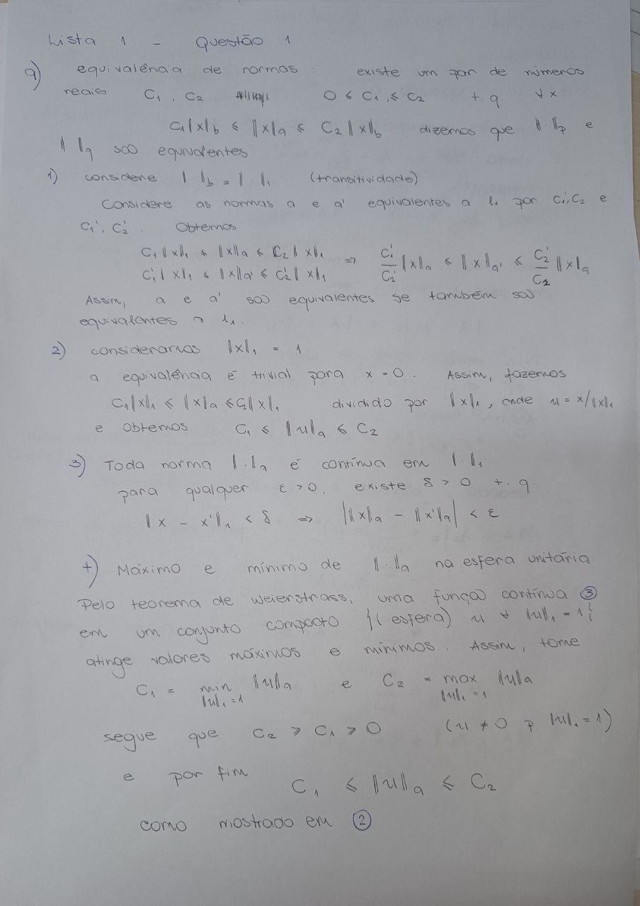
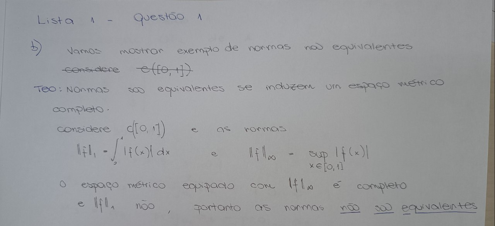
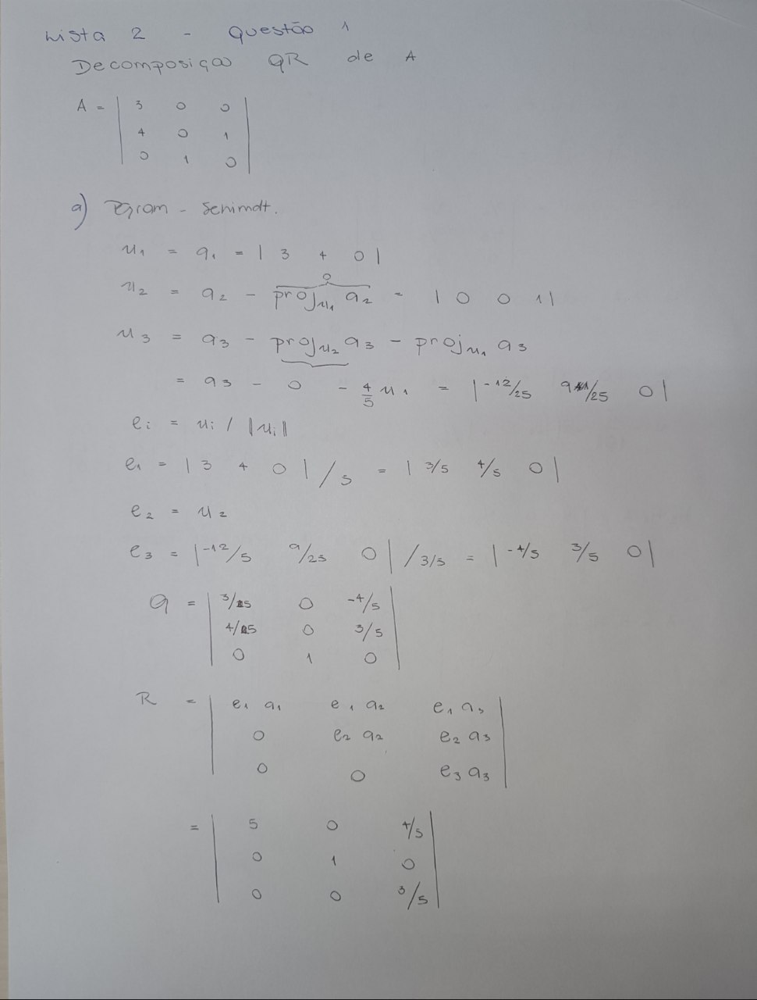
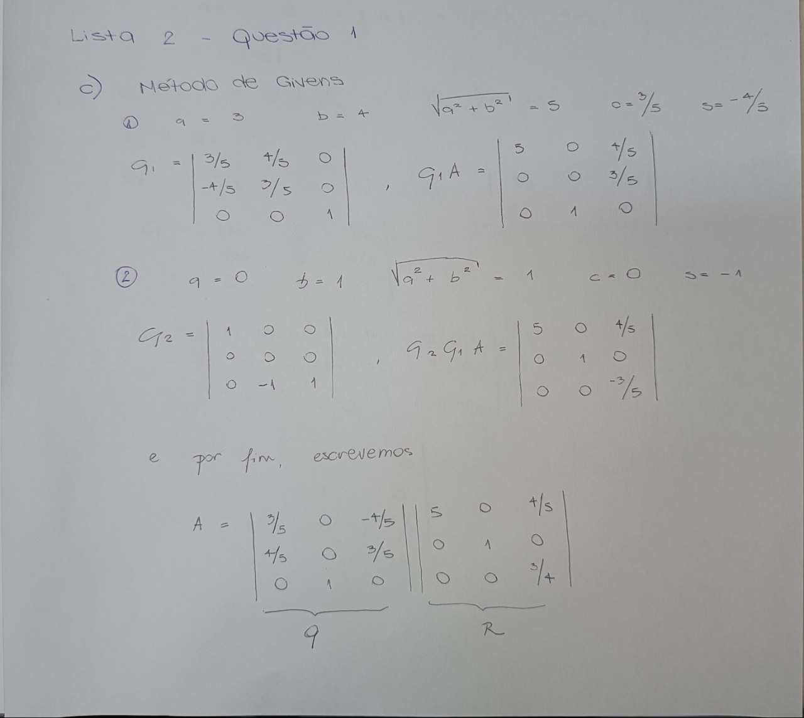
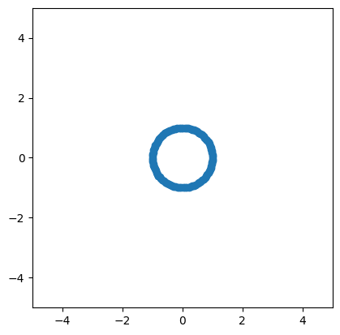
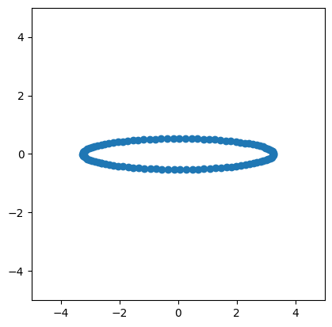
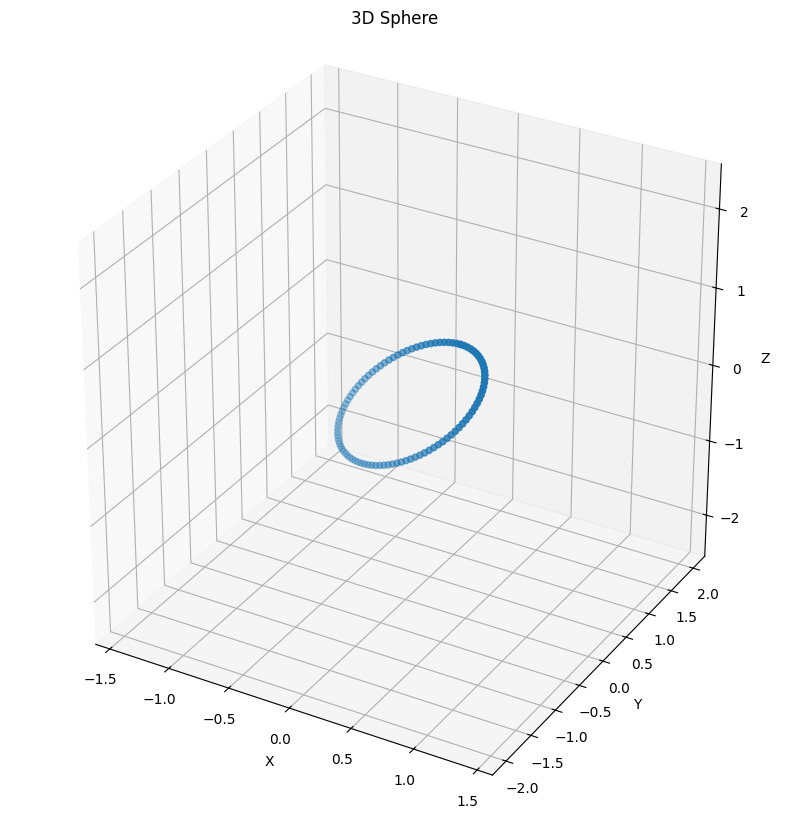
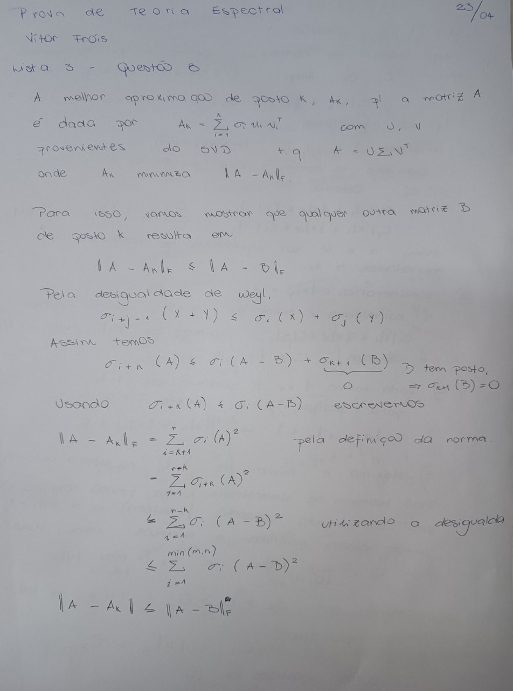

# Lista 1

## Exercício 1

{ width=450px }



## Exercício 7

Utilizando os pares $(v_i, \lambda_i)$, podemos escrever $Av_i=v_i\lambda_i$. Passando para forma matricial obtemos

$$A V = \Sigma V$$

onde $V$ é uma matriz de autovetores e $\Sigma$ uma matriz diagonal de autovalores. Assim, $A=V\Sigma V^{-1}$.

Os vetores formam uma base ortonormal, portanto $V^{-1}=V^{T}$ e escrevemos $A = V\Sigma V^{T}$.

Qualquer matriz $A$ pode ser escrita como $A=MN=\sum_{i=1}^n m_i n_i$. De forma semelhante, $A=MN=\sum_{i=1}^n v_i \sigma_i v_i^{T}$ e finalmente obtemos 

$$
A = \lambda_1 v_1 v_1^{T} + \lambda_2 v_1 v_2^{T} + ... + \lambda_n v_n v_n^{T}
$$

## Exercício 8 

Vamos mostrar que $f(A) = Pf(D)P^{-1}$ quando $A$ tem decomposição espectral $A = PDP^{-1}$ e $f$ possui expansão via série de Taylor.

Podemos escrever

$$
f(A) = f(0) + \frac{f'(0)}{1!}A + \frac{f''(0)}{2!}A^2 + \frac{f'''(0)}{3!}A^3 + ...
$$

e de forma mais compacta, 

$$
f(A) = \sum_{n=0}^\infty C_n A^n
$$

onde o coeficiente $C_n=\frac{f^{(n)}(0)}{n!}$. Os componentes da série são independentes. 

Lembrando que $A = PDP^{-1}$, escrevemos $A^{n} = PD^{n}P^{-1}$. Por indução, 
$$
A^{n+1} = PD^{n}P^{-1}PDP^{-1}=PD^{n}DP^{-1}=PD^{n+1}P^{-1}.
$$ 

Dessa forma, 

$$
f(A) = \sum_{n=0}^\infty C_n P(D^n)P^{-1} = P \big(\sum_{n=0}^\infty C_nD^n\big) P^{-1} = P f(D) P^{-1}.
$$

# Lista 2

## Exercício 1

{ width=500px }



\newpage

# Lista 3
## Exercício 4

$$A = U \Sigma V^{T}$$

Qualquer matriz $A$ pode ser escrita como $A=MN=\sum_{i=1}^n m_i n_i$. Considere $M = U \Sigma$ uma matriz formada pelos vetores $u_i \sigma_i$ e $N=V^T$. Segue $A=MN=\sum_{i=1}^n u_i \sigma_i v_i^{T}$ e finalmente obtemos 

$$
A = \sigma_1 u_1 v_1^{T} + \sigma_2 u_1 v_2^{T} + ... + \sigma_n u_n v_n^{T}
$$


## Exercício 5

## Interpretando Transformações Lineares via SVD

Considere a matriz $\mathbf{A}$ como uma transformação linear de $\mathbb{R}^n$ para $\mathbb{R}^m$, temos que:

$$
\mathbf{y}=\mathbf{A}\mathbf{x}=(\underbrace{\mathbf{U}(\overbrace{\Sigma(\underbrace{\mathbf{V}^\top\mathbf{x}}_{\text{projeção}}}^{\text{escala}}))}_{reconstrução})
$$

- $\mathbf{V}^\top\mathbf{x}$:</font> Projeção do vetor $\mathbf{x}$ na base $\mathbf{v}_i$.

- $\mathbf{\Sigma}\mathbf{V}^\top\mathbf{x}$:
Escala cada coeficiente por $\sqrt{\lambda_i}$

- $\mathbf{U}\mathbf{\Sigma}\mathbf{V}^\top\mathbf{x}$: $\mathbf{y}$ é combinação linear dos $\mathbf{u}_i$ com coeficientes $\sqrt{\lambda_i}\mathbf{v}_i^\top\mathbf{x}$


## Visualizando Transformações

O código completo está no [Google Colab](https://colab.research.google.com/drive/1Df4bS0MxSdSi0PzGOsEuDayO_33sI20l?usp=sharing)

``` python
U, S, Vt = np.linalg.svd(A, full_matrices=False)
```

``` python
scatter2d(circle)
```
{ width=250px }

``` python
scatter2d(Vt @ circle)
```
{ width=250px }

\newpage

``` python
scatter2d(np.diag(S) @ Vt @ circle)
```
{ width=250px }

``` python
scatter3d(U @ np.diag(S) @ Vt @ circle)
```
{ width=250px }

## Exercício 8

{ width=500px }
