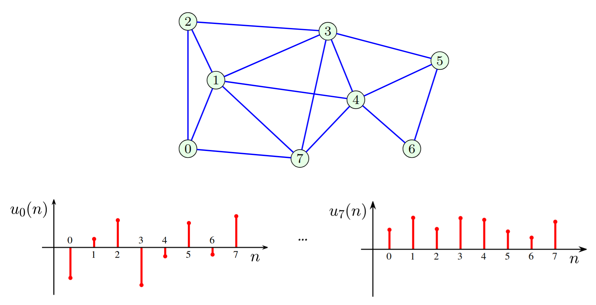
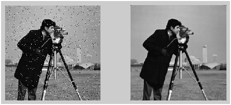

\tableofcontents

# Introdução 

# Metodologia

## Decomposição de uma função polinomial sobre uma matriz

A decomposição espectral de uma matriz de adjacência $A^2$ é dada por

$$A^2 = U\Lambda U^{-1}U\Lambda U^{-1} = U\Lambda^2 U^{-1}$$

Podemos generalizar para qualquer potência $A^n$:

$$A^n = U\Lambda^n U^{-1}$$

Em geral, para qualquer função de matriz $f(A)$ que possui forma polinomial:

$$f(A) = h_0 A^0 + h_1 A^1 + h_2 A^2 + \dots + h_{N-1} A^{N-1}$$

a decomposição espectral é:

$$f(A) = Uf(\Lambda)U^{-1}$$

## Base de uma Transformada de Fourier como o caso especial dos autovetores da matriz de adjacências 

A transformada de Fourier é uma ferramenta para decompor uma imagem complexa em componentes fundamentais utilizando funções ortogonais. Para sinais contínuos, a transformada é uma soma infinita. Já no caso discreto, encontramos uma soma finita de vetores ortogonais que representa o sinal original. 

No processamento de sinais, diversos algoritmos - DFT, Wavelets - consideram que o sinal é cíclico: a última amostra $x(N-1)$ é procedida por $x(0)$. Assim, um sinal discreto pode ser representado por um grafo cíclico, onde cada vértice possui o valor do sinal no ponto correspondente e as arestas conectam pontos imediatamente vizinhos. A matriz de adjacência para esse caso é definida como: 

$$
A = \begin{pmatrix}
0 & 1 & 0 & \dots & 0 \\
0 & 0 & 1 & \dots & 0 \\
0 & 0 & 0 & \dots & 0 \\
\vdots & \vdots & \vdots & \ddots & \vdots \\
0 & 0 & 0 & \dots & 1 \\
1 & 0 & 0 & \dots & 0
\end{pmatrix}
$$

Autovalores e autovetores para a matriz $A$ são respectivamente definidos por $u_k$ e $\lambda_k$ em que $\mathbf{A} \mathbf{u}_k = \lambda_k \mathbf{u}_k$. Podemos reescrever a equação utilizando a matriz de adjacências do grafo cíclico para obter

$$
u_k(n - 1) = \lambda_k u_k(n)
$$

Onde $u_k(n)$ são os elementos do vetor $u_k$. Uma solução para essa equação é:

$u_k(n) = \frac{1}{\sqrt{N}} e^{j2\pi nk/N}$ e $\lambda_k = e^{-j2\pi k/N}$

para $k = 0, 1, \dots, N - 1$

Esses autovetores correspondem as bases de uma Transformada de Fourier Discreta nesse caso.

## Transformada de Fourier em Grafos

Tradicionalmente, sinais são frequentemente analisados e processados no domínio espectral. Essa abordagem também pode ser estendida a grafos. Representações no domínio espectral se baseiam na matriz de adjacências ou na Laplaciana. 

A Transformada de Fourier em Grafos (GFT) de um sinal $x$ é definida como:

$$X = U^{-1}x$$

Onde $U$ é uma matriz com os autovetores da matriz de adjacência (ou Laplaciana) em suas colunas. Assim, a Transformada de Fourier de Grafo pode ser entendida como uma decomposição de sinal no conjunto de autovetores como funções base ortonormais.

A Transformada Inversa de Fourier em Grafos (IGFT) é:

$$x = U X$$

## Ordem Espectral

Para estabelecer filtros em grafos, precisamos estabelecer uma **ordem espectral**. Isso significa que devemos definir autovetores que correspondem a variação lenta ou variação rápida.

Na análise de Fourier clássica, a base é ordenada de acordo com a frequência. A inspiração vem da análise de Fourier clássica. Nesse caso, em vez da frequência, utilizamos a energia da mudança do sinal como um indicador da velocidade de uma mudança de sinal no tempo.

A energia da mudança de um sinal (uma função base) $u(n)$ pode ser definida como a energia da primeira diferença:

$$E_{\Delta u} = \sum_{n=0}^{N-1} |u(n) - u(n - 1)|^2$$

Valores menores de $E_{\Delta u}$ significam que $u(n)$ varia lentamente. O valor $E_{\Delta u} = 0$ indica, na análise de sinal clássica, que o sinal é constante. Já valores grandes de $E_{\Delta u}$ estão associados a mudanças rápidas de sinal no tempo. 
Intuitivamente, isso faz sentido - funções mais homogêneas possuem energia 0. Já funções com maior variação possuem alta frequência. 

### Matriz de Adjacências

Em grafos, a primeira diferença pode ser definida como a diferença entre o sinal de grafo e a versão deslocada do sinal pela matriz de adjacências. Para um autovetor $u$, sua forma é:

$$\Delta u = u - u_1 = u - A_{norm}u$$

A energia da mudança do sinal é:

$$E_{\Delta u} = \|u - A_{norm}u\|^2_2$$
$$= \left\|u - \frac{1}{\lambda_{max}}Au\right\|^2_2$$
$$= \left\|u - \frac{1}{\lambda_{max}}\lambda u\right\|^2_2$$
$$= \left|1 - \frac{\lambda}{\lambda_{max}}\right|^2$$

A energia do sinal é mínima para $\lambda = \lambda_{\text{max}}$ e aumenta a medida que $\lambda$ decai.

### Matriz Laplaciana

Uma abordagem similar pode ser utilizada para a decomposição baseada na Laplaciana. É evidente que os autovetores $u(n)$ com pequenas mudanças devem ter uma pequena energia cumulativa da diferença de segunda ordem $E_u = \sum_n((u(n)-u(n-1))^2 +(u(n)-u(n+1))^2)/2$. Este valor corresponde à forma quadrática do autovetor $u$ definida por $E_u = u^T L u$. Por definição,

$$Lu = \lambda u$$

e assim,

$$u^T L u = \lambda u^T u = \lambda = E_u$$

Os autovetores associados aos menores autovalores são de baixa frequência. A frequência aumenta de acordo com o autovalor.

\newpage

## Filtros
Antes de apresentar filtros em grafos, mostramos como é a filtragem em imagens. Os filtros são utilizados para livrar-se de detalhes que não são importantes. Na imagem abaixo, frequência elevadas representam ruído e são filtradas utilizando a transformada de Fourier.

Para grafos, analisamos um filtro no domínio espectral. Um filtro passa-baixa ideal no domínio espectral da matriz de Laplaciana, com um autovalor de corte $\lambda_c$, é definido como:

$$f(\lambda) = \begin{cases} 1 & \text{para } \lambda < \lambda_c \\ 0 & \text{para outras } \lambda. \end{cases}$$

Note que o mesmo filtro não funciona para a matriz de Adjacências já que a ordenação dos nós é inversa. O objetivo de assinalar 1 para certos valores e 0 para outros, é retirar frequências altas - ou seja, realizar uma filtragem.

## Aprendizado de Máquina

Um modelo de aprendizado de máquina aprende uma função $f$ dado um conjunto de vetores de entrada $X_i$ e respostas $Y_i$ com a melhor aproximação $Y_i=f(X_i), \forall i$. Um exemplo simples é o modelo linear, onde aprendemos pesos $W$ tal que $Y=XW$.

Um modelo de aprendizado em grafos recebe não apenas os dados $X,Y$, como também informações sobre a estrutura subjacente do Grafo $G$, como a Laplaciana ou Matriz de Adjacência.

$$
Y=f(G, X)
$$

## Graph Convolutional Networks

As Graph Neural Networks (GNNs) representam um avanço significativo no aprendizado e na mineração de dados em grafos. Inicialmente, as redes convolucionais espectrais abriram caminho para aprender filtros de forma direta, mas enfrentavam desafios de complexidade computacional. A pesquisa então se moveu para otimizar esses filtros usando aproximações polinomiais, levando a modelos mais eficientes como as Graph Convolutional Networks (GCN), que simplificou drasticamente o processo e inspirou uma série de inovações, incluindo a incorporação de mecanismos de atenção e a fusão com aprendizado relacional. 
Nessa evolução, foi descoberto o problema de *over-smoothing*, onde o desempenho das GNNs pode diminuir com um número crescente de camadas. Em resposta a isso, abordagens inovadoras surgiram para linearizar o modelo, removendo as operações de ativação não-lineares entre as camadas sequenciais. Essa simplificação resulta em modelos GCNs mais eficientes e, surpreendentemente, igualmente eficazes, demonstrando que a linearização pode ser uma estratégia poderosa para otimizar o desempenho e a aplicabilidade das GNNs.

## Heat Kernel 
A equação do calor é um caso especial da equação de difusão utilizada para descrever como o calor se distribui e flui ao longo do tempo.

Imagine um cenário de grafo, no qual cada nó tem uma temperatura e a energia térmica só pode ser transferida ao longo das arestas. A propagação de calor entre o nó $v_i$ e o nó $v_j$ deve ser proporcional ao peso da aresta e a diferença de temperatura entre $v_i$ e $v_j$. Seja $x(t)_i$ a temperatura de $v_i$ no tempo $t$, a difusão de calor no grafo $G$ pode ser descrita pela seguinte equação do calor:

$$\frac{dx(t)_i}{dt} = -k \sum_j A_{ij} (x(t)_i - x(t)_j) = -k[D_{ii}x(t)_i - \sum_j A_{ij} x(t)_j]$$

A equação na forma matricial é $\frac{dX(t)}{dt} = -kLX(t)$, onde $L = D - A$ é a matriz Laplaciana do grafo. Reparametrizando $t$ e $k$ em um único termo $t' = kt$, a equação pode ser reescrita como:

$$\frac{dX(t')}{dt'} = -LX(t')$$

O **heat kernel** é a solução fundamental da equação do calor e é definido como a matriz 

$$H_t = e^{-Lt}$$

Dado o status inicial $X(0) = X$, a solução para a equação do calor pode ser escrita como:

$$X(t) = H_tX(0)$$

Naturalmente, o Heat Kernel pode ser usado como a matriz de propagação de características em GCNs.

## Simple Graph Convolutional Networks

No contexto de simplificação de modelos de GCN, removemos as não-linearidades para obter um modelo linear onde as propriedades dos nós são difundidas através do grafo. O modelo pode ser expresso como:

$Y = H_t X W$

onde $H_t = e^{-Lt}$ é o **Kernel de Calor**, funcionando como a matriz de difusão que propaga as características iniciais $X$ (matriz de *features* dos nós) através da estrutura do grafo. $W$ é uma matriz de pesos treinável, aprendida pelo modelo. Essa formulação permite uma difusão de características baseada em um processo de calor contínuo, sem as complexidades das ativações não-lineares.

**Regressão**: quando o $Y\in \mathbb{R}$, há uma regressão linear nos vértices e podemos escrever $Y = e^{-Lt} X W$.

**Classificação**: quando $Y$ é categórico, passamos para uma regressão logística. Nesse caso, escrevemos $Y = \text{softmax}(e^{-Lt} X W)$

**Outros**: é possível ajustar a função de acordo com a distribuição de $Y$. 

## Análise Espectral do Kernel

Como $f(L) = U f(\Lambda) U^T$, o **kernel de calor** $H_t = e^{-Lt}$ também pode ser visto como um polinômio de $L$. Assim, seu filtro de kernel é $g(\lambda_i) = e^{-\lambda_i t}$. Os autovalores são positivos. 

Para quaisquer $i, j$, se $\lambda_i < \lambda_j$, temos
$$
\frac{f(\lambda_i)}{f(\lambda_j)} = e^{(\lambda_j-\lambda_i)t} > 1
$$
Assim,
$$
g(\lambda_i) > g(\lambda_j)
$$

Isso mostra que o Heat Kernel atua como um **filtro passa-baixa**. À medida que $t$ aumenta, a razão $e^{(\lambda_j-\lambda_i)t}$ também aumenta, atenuando cada vez mais as altas frequências. 

# Referências

- [Introduction to Graph Signal Processing](https://www.researchgate.net/profile/Ljubisa-Stankovic/publication/329350163_Introduction_to_Graph_Signal_Processing/links/631b228170cc936cd3f6120f/Introduction-to-Graph-Signal-Processing.pdf)
- [Heat Kernel Graph Convolutions](https://openreview.net/forum?id=yBJihVXahXc)
- [Simplifying Graph Convolutions](https://arxiv.org/abs/1902.07153)
